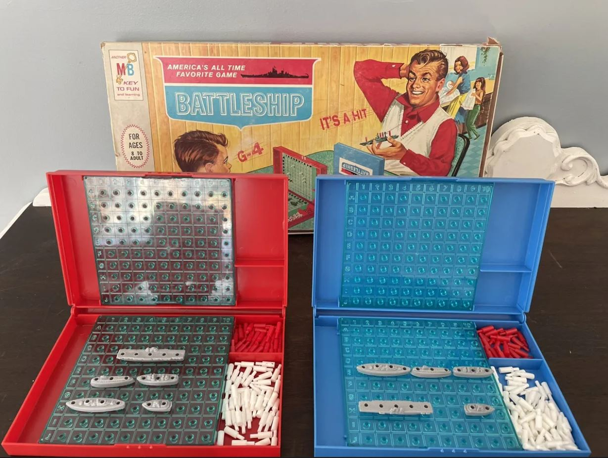
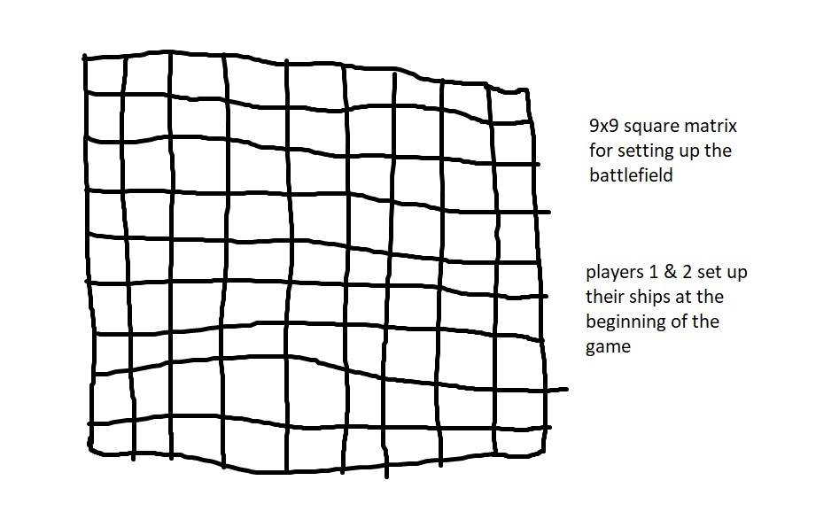
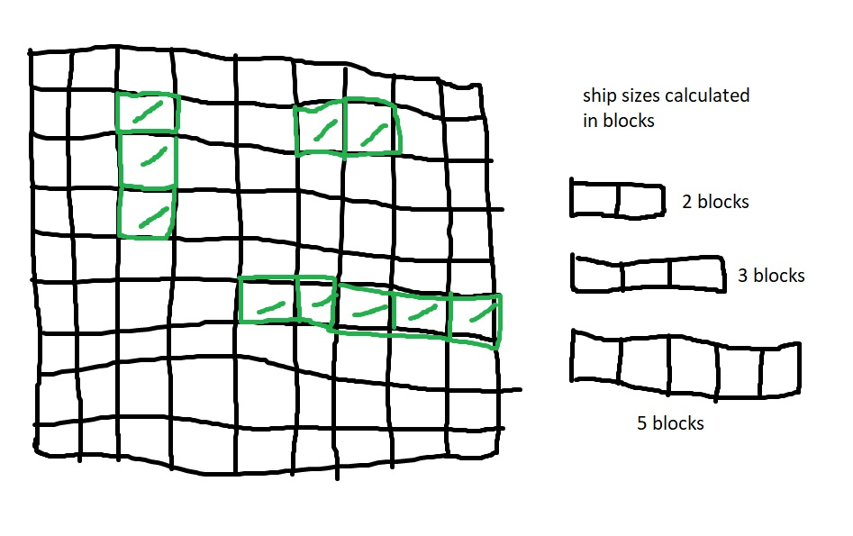
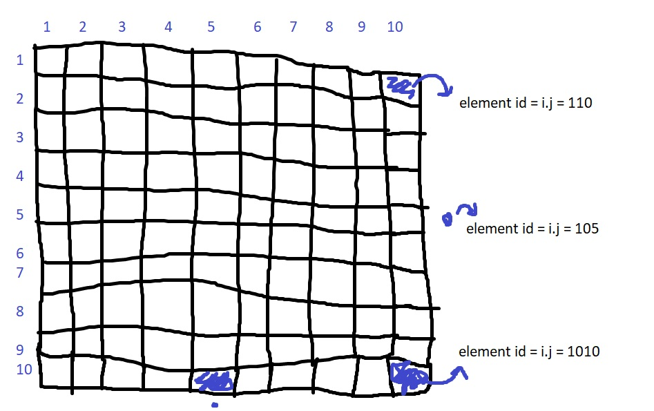
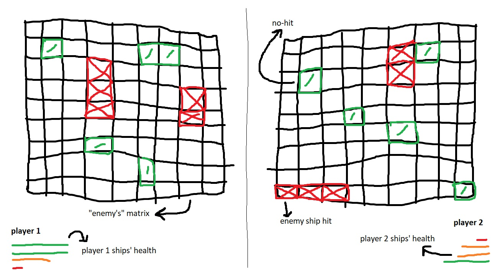
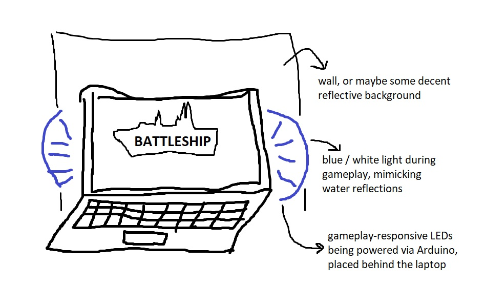
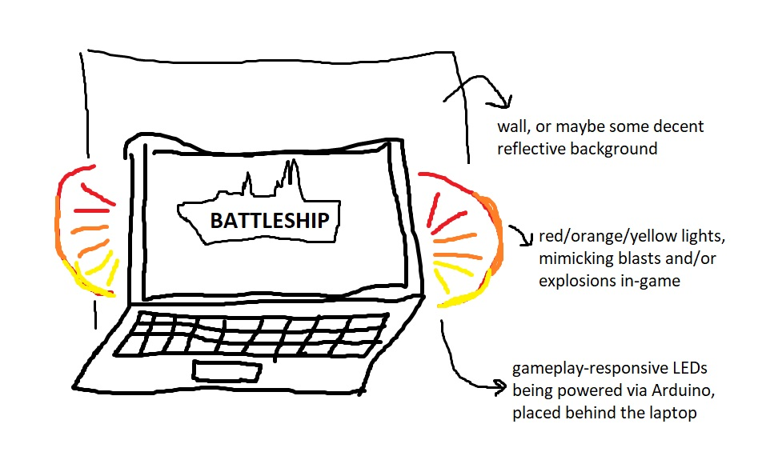

# Battleship - The Digital Version
**Technologies Used:** JavaScript, p5.js, CSS, Arduino

  
  Figure 0.1: The Original Battleship Board Game

*Battleship* is a turn-based strategy-type guessing game for two players. It is played on ruled grids on which each player's fleet of warships are marked. The locations of the fleets are concealed from the other player. Players alternate between calling "shots" at the other player's ships, and the objective of the game is to destroy the opposing player's fleet.

I've developed a web-based version of this game using web technologies like JavaScript & p5.js, and I've included several diverse elements like a background score, situation-specific sound effects, and ambient / environment lighting (via Arduino).

## PART 1: THE IDEATION PROCESS

▶️▶️ **GAME INTERFACE & CODE**

The game would start off with the first player plotting the positions of their battleships in a 9 x 9 square matrix. Once they’re done, the second player repeats the same process.

  
   
  Figure 1.1: Player Setup Matrix

As there would be just 81 squares (9 x 9 matrix), as opposed to the original game’s 10 x 10 or 12 x 12 dimensions, I’d probably limit the total number of battleships available with each player. The players generally have 5 ships of varying sizes, but given the smaller size of the battlefield, I’d scale that quantity down accordingly.

The ship sizes are calculated in blocks, so players can have ship sizes ranging between 2-5 blocks, either horizontally or vertically.

  
   
  Figure 1.2: Ship Sizes & Orientation

I’m thinking of coding a 9 x 9 matrix instead of having a full-size board because, I feel, anything beyond 9 would involve more specific code for indices “10” and above, in addition to the code that’d be there for rest of the matrix. For example, in a 10 x 10 matrix, if the block IDs range from 1.1, 1.2, 1.3 … 1.10, I’d need to factor in additional logic & code for calculating individual row & column indices for 1.10, 2.10, 10.10 etc. Hence, in the interest of time, I’m limiting it to 9 x 9 matrix.

  
   
  Figure 1.3: Matrix Dimension & Element IDs

Once the players have set their ships, the game would begin. Both players would take turns in guessing the squares where the enemy's ships are placed, and destroying them. I imagine the gameplay interface having two matrices side-by-side, in a split-screen fashion. The left-half of the screen would be Player 1’s console, and it would display a matrix for marking Player 2’s ships, and “health” details regarding their own ships. The right-half of the screen would display the same interface, but from Player 2’s perspective.

  
   
  Figure 1.4: The Gameplay Interface

Whichever player destroys all the ships of the other player first, wins the game.

▶️▶️ **VISUAL & SONIC IMMERSION**

In order to make the game immersive and more appealing, I plan on introducing both, sound and light elements. I am thinking of incorporating a background score that matches the theme of battleship, probably some military-themed music, or something fast-paced during the actual gameplay.

Additionally, I plan on having specific sound effects for the game. For example, in case a player guesses a correct square and hits the other player’s ship, a “blast” sound would be played, or if the player misses, a "water splash" sound effect could be cued.

Furthermore, I plan of having some ambient or environment lighting for the game via LEDs, controlled by Arduino. I imagine blue & white light during normal gameplay (mimicking water reflections), or orange & red LEDs lighting up during ship hits to mimic blasts.

  
   
  Figure 1.5: Ambient Lighting: Blue-White LEDs Mimicking Water Reflections
   
   
  
   
  Figure 1.6: Ambient Lighting: Red-Orange LEDs Mimicking Ship Blasts

## PART 2: THE REALIZATION PROCESS