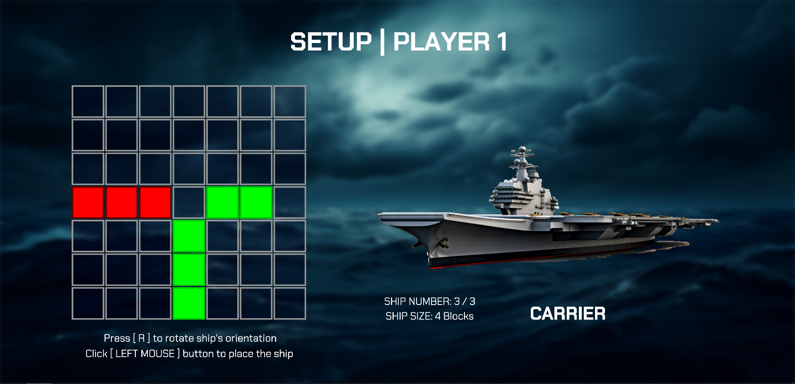
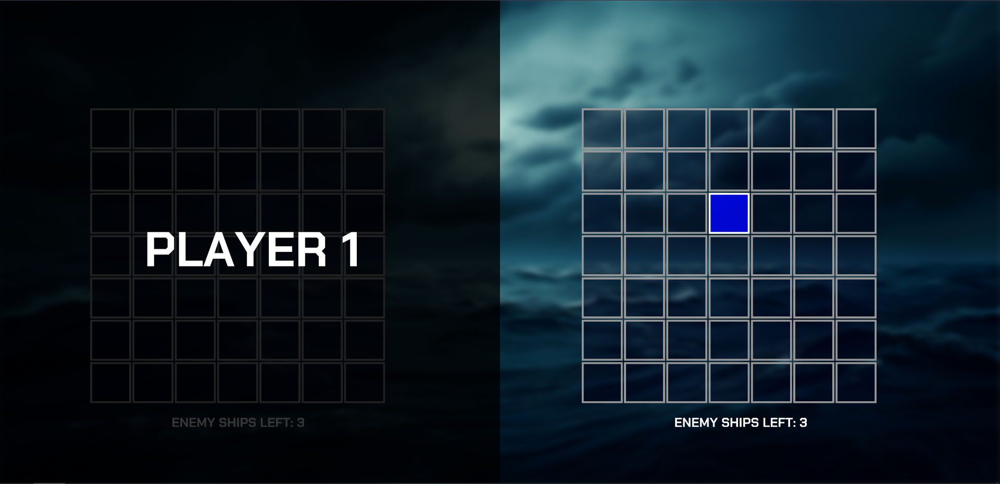
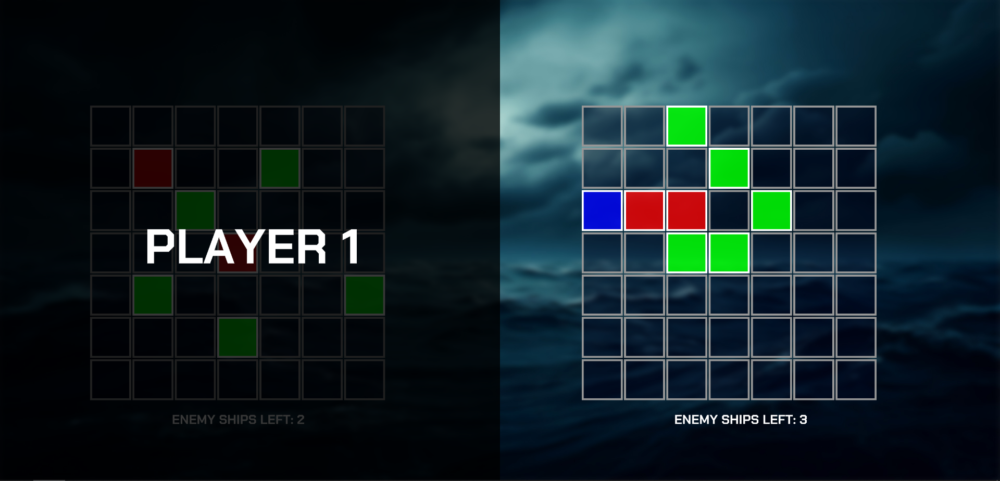
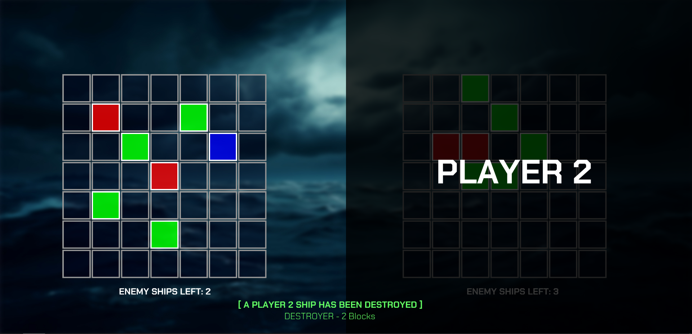
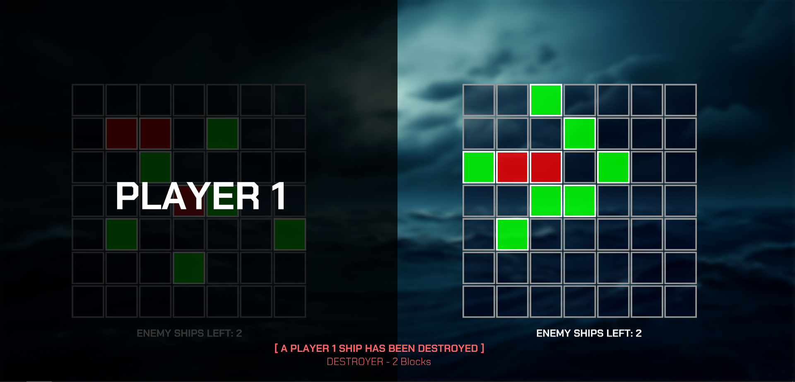
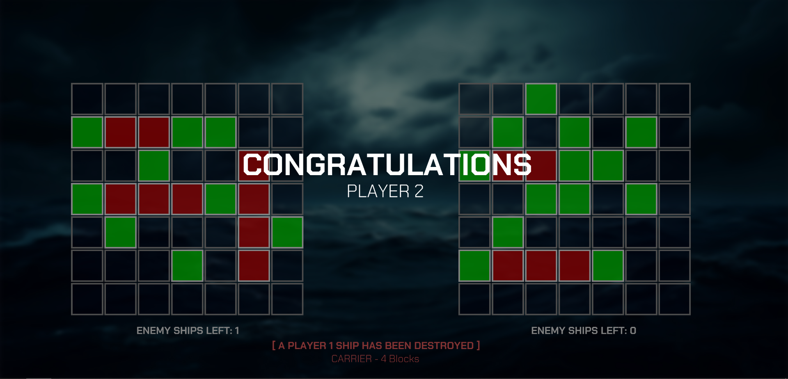

# Battleship - The Digital Experience
**Languages Used:** JavaScript, p5.js, CSS, HTML
**AI Tools Used:** Midjourney, Luma AI, Kling AI, ChatGPT, Udio
**Software Used:** VS Code, GitHub, Adobe Photoshop, Adobe After Effects, FL Studio

<p align = "center">
  
  Figure 0.1: The Original Battleship Board Game
</p>

*Battleship* is a turn-based strategy-type guessing game for two players. It is played on ruled grids on which each player's fleet of warships are marked. The locations of the fleets are concealed from the other player. Players alternate between calling "shots" at the other player's ships, and the objective of the game is to destroy the opposing player's fleet.

I've developed a web-based version of this game using technologies like JavaScript & p5.js, and I've included several diverse elements like a background score and situation-specific sound effects.

## PART 1: THE IDEATION PROCESS

### ▶️▶️ **GAME INTERFACE & CODE**

The game would start off with the first player plotting the positions of their battleships in a 9 x 9 square matrix. Once they’re done, the second player repeats the same process.

<p align = "center">
  
  <br>
  Figure 1.1: Player Setup Matrix
</p>

As there would be just 81 squares (9 x 9 matrix), as opposed to the original game’s 10 x 10 or 12 x 12 dimensions, I’d probably limit the total number of battleships available with each player. The players generally have 5 ships of varying sizes, but given the smaller size of the battlefield, I’d scale that quantity down accordingly.

The ship sizes are calculated in blocks, so players can have ship sizes ranging between 2-5 blocks, either horizontally or vertically.

<p align = "center">
  
  <br>
  Figure 1.2: Ship Sizes & Orientation
</p>

I’m thinking of coding a 9 x 9 matrix instead of having a full-size board because, I feel, anything beyond 9 would involve more specific code for indices “10” and above, in addition to the code that’d be there for rest of the matrix. For example, in a 10 x 10 matrix, if the block IDs range from 1.1, 1.2, 1.3 … 1.10, I’d need to factor in additional logic & code for calculating individual row & column indices for 1.10, 2.10, 10.10 etc. Hence, in the interest of time, I’m limiting it to 9 x 9 matrix.

<p align = "center">
  
  <br>
  Figure 1.3: Matrix Dimension & Element IDs
</p>

Once the players have set their ships, the game would begin. Both players would take turns in guessing the squares where the enemy's ships are placed, and destroying them. I imagine the gameplay interface having two matrices side-by-side, in split-screen fashion. The left-half of the screen would be Player 1’s console, and it would display a matrix for marking Player 2’s ships, and “health” details regarding their own ships. The right-half of the screen would display the same interface, but from Player 2’s perspective.

<p align = "center">
  
  <br>
  Figure 1.4: The Gameplay Interface
</p>

Whichever player destroys all the ships of the other player first, wins the game.

### ▶️▶️ **VISUAL & SONIC IMMERSION**

In order to make the game immersive and more appealing, I plan on incorporating a background score that matches the theme of battleship, probably some military-themed music, or something fast-paced during the actual gameplay.

Additionally, I plan on having event-specific sound effects for the game. For example, in case a player guesses a correct square and hits the other player’s ship, a “blast” sound would be played, or if the player misses, a "water splash" sound effect could be cued.

## PART 2: THE REALIZATION PROCESS

Before I begin explaining about the gameplay and the development process, I want to briefly touch upon the challenges I faced while coding this. TBH, this was quite an ambitious endeavor, and I wasn't fully sure whether I'd be able to code all the functionalities that I had thought of, or proposed during the ideation process.

This game (along with all its aspects) is a culmination of a month-long effort involving coding, debugging, retrying, experimenting, and learning new things, with bouts of frustration & stress sprinkled in-between, and the remaining time being devoted to my unrelenting determination to get all my elements (and the code) working. Building this from the ground up was nothing short of a rollercoaster ride, but extremely fun and exciting nevertheless.

At long last, I present to you ... **Battleship - The Digital Version.**

<p align = "center">
  
  <br>
  Figure 2.1: Battleship - Digital Version Splash Screen
</p>

### ▶️▶️ **BATTLESHIP: PLAYER SETUP SCREENS**

The game starts off with the setup screens, wherein the players set their battleships' positions on the grid. In order to keep the duration of the game short, I chose to proceed with 7 x 7 matrices for both the players, instead of the initially proposed 9 x 9 matrices.

The setup screen displays the grid where the players would place their ships, the quantity of battleships they have and their respective sizes (in blocks), and the type of ship they're currently placing along with a graphic of the same. I had to scour the depths of *Adobe Stock* in order to gather the ship images that matched my aesthetic. I reduced their sizes post downloading in order to optimize the game's performance, and the browser's resource utilization.

<p align = "center">
  
  <br>
  Figure 2.2: Player Setup Screen - Player 1
</p>

On hovering over the grid with the mouse, the squares start lighting up based on what size of the ship the player's placing. The hover-state informs the player of the "placing" status i.e. whether they can place the ship in those squares or not. Squares being green on-hover mean that it's a valid placement. If it's an invalid placement, the squares would turn red.

I've coded in functionalities that check for the matrix's edges; or if the player's placing a second ship on top of another placed ship; or if the entire ship in its current orientation (horizontally or vertically) can fully fit within the matrix grid. If any of these conditions are detected by the code, the squares on-hover would turn red in real-time, indicating the placement status to the player.

<p align = "center">
  
  <br>
  Figure 2.3: Grid Edge Detection & Dynamic Color-Change
  <br>
  <br>
  
  <br>
  Figure 2.4: Ship Overlap Detection & Dynamic Color-Change
</p>

Additionally, players can rotate their ships in 360° fashion by pressing the [ R ] key on the keyboard. The code seamlessly checks for all the above conditions dynamically for any orientation the player chooses.

```
//rotate the ship on key-press
if(key == 'r' && keyIsPressed == true)
{
  rotateFlag+=90;
  keyIsPressed = false;

  //ship orientation completes full circle
  if(rotateFlag == 360)
  {
    rotateFlag = 0;
  }
}
```

<p align = "center">
  
  <br>
  Figure 2.5: Ship Rotation Functionality
</p>

The players "place" their ships by clicking the left-mouse button. Coding the placing part was quite complicated, because that involved passing the selected squares' coordinates from the *Battlegrid* class to the *Battleship* class. The *Battleship* class contains details regarding the player's ship positions, their respective size, and the type.

Every square has a unique ID which is a combination of its row and column number. This unique ID is the coordinate for that specific square. I was initially using math to ascertain coordinates and storing them in a single variable called *grid_id*, by using the formula ***(10 x i) + j***, where *i* was the square's row-number, and *j* was the column-number. This quickly became quite problematic when I needed to manipulate certain aspects during gameplay that revolved around a square's coordinate. As a solution, I replaced the single *grid_id* variable with two dedicated variables that stored the square's row & column numbers, *grid_id_row* and *grid_id_col*. These were simple to manipulate, and straightforward to pass off to functions, arrays, or classes during gameplay code execution.

Once this was sorted, I now had to figure out how to pass the ***correct*** coordinate sequence to the *Battleships* class on mouse-press. This turned out to be challenging as well. I was making use of certain flags like *grid_hoverFlag* and *grid_occupiedFlag* to filter the squares to be passed, but my code was either passing off wrong coordinates, or more number of squares than the ship size. I ultimately solved it using array modification functions.

The variable *grid_hoverFlag* for a square fluctuates between 0 and 1 depending on whether it's being hovered on by the mouse. Based on the variable values, I started passing all square coordinates that had *grid_hoverFlag* value as 1, and on mouse-press, I just trim the array to the particular ship size using the *splice()* function to retain the correct values of the ship coordinates.

```
//remove all the grid IDs from Battleship, except the latest ones for the given ship_blockSize
p1_battleships_array[p1_shipNumber].shipGrids.splice(0, p1_battleships_array[p1_shipNumber].shipGrids.length-(ship_blockSize*2));
```

<p align = "center">
  
  <br>
  Figure 2.6: All Ships - Successful Placement
  <br>
  <br>
  
  <br>
  Figure 2.7: Player Setup Screen - Player 2
</p>

Once both players have set their ships, the game begins.

### ▶️▶️ **BATTLESHIP: GAMEPLAY INTERFACE**

The main gameplay interface consists of both players' matrices present in split-screen view. A black overlay disables half of the interface depending on which player's turn it is. Both players take turns to select squares, and ultimately, destroy all the ships of the other player.

<p align = "center">
  
  <br>
  Figure 2.8: Battleship - Gameplay Interface
</p>

A blue highlight appears on the square that is being hovered-on by the mouse. On mouse-press, the square's color would change either to green or red, depending on whether a ship's part is present there or not.

<p align = "center">
  
  <br>
  Figure 2.9: Gameplay - Mouse-Click Interaction
</p>

If a player destroys a ship completely, a notification pops up at the bottom informing about the type of ship destroyed, and its size. The notifications are color-coded to mitigate any confusion, where green-colored notification appears when Player 2 destroys Player 1's ship; and a red-colored notification appears when Player 1 destroys Player 2's ship.

Beneath the players' grids, I've provided an "enemy ship counter" which keeps the players informed about how many ships, of the other player, remain.

<p align = "center">
  
  <br>
  Figure 2.10: Ship Destroyed Notification for Player 1
  <br>
  <br>
  
  <br>
  Figure 2.11: Ship Destroyed Notification for Player 2
</p>

The game continues until a player destroys *all* the ships of the other player. Once the code detects that all ships for a particular player have been destroyed, the game ends. The black overlay goes away, revealing both the players' matrices in the background, and a congratulatory message is presented, along with the winning player's number on-screen.

<p align = "center">
  
  <br>
  Figure 2.12: Winner Announcement & Grid Display
</p>

### ▶️▶️ **BATTLESHIP: SONIC ELEMENTS**

In order to make the game more interesting, I've included background scores throughout the entirety of the game. An ominous pulsating piece of music plays repeatedly during the player setup screens, signalling "peace before the storm" and foreboding all-out warfare.

The music switches gears and becomes fast-paced & exhilerating during actual gameplay to infuse that competitive spirit among the players. It only comes to a stop when the game finishes, and the winner is announced.

In addition to the background scores, I've coded in scenario-specific sound effects as well. During gameplay, if on mouse-click, the player hits a part of a ship, an explosion sound is played, signifying the action. If the player misses, a water splash sound is cued for effect.